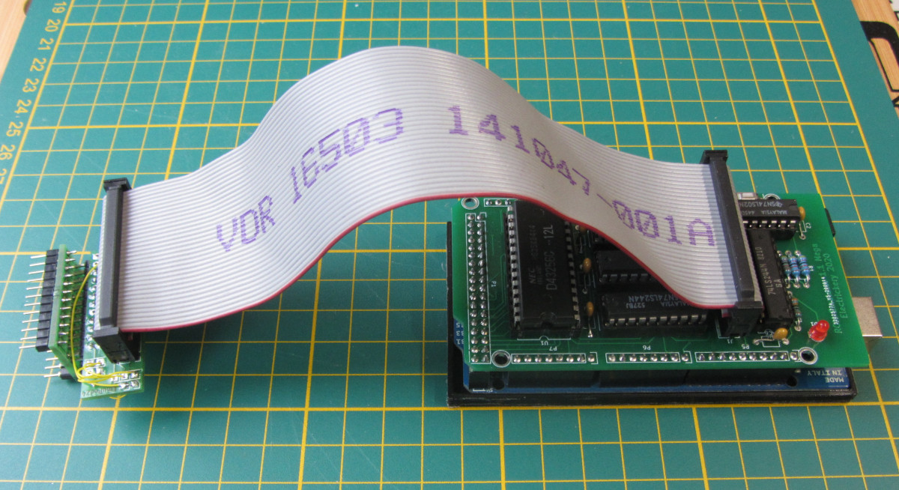

# ROM-emulator
Emulate a small size ROM with a RAM and Arduino with Intel-HEX interface

ROMemu is a combination of software and hardware that allows the usage of modern software development tools for simple, old style single board computer systems. It emulates an (EP)ROM programmer to the development software and an in-circuit ROM/RAM on the board.

The software (Arduino sketch) is version 0.8.

The current hardware version 1.1 uses an Arduino Mega 2560 with a shield containing a 32 kByte RAM-chip which is (partially) readable by the SBC-processor. The Arduino USB-connection is available as serial port to the development system. This allows to write Intel-hex data to the RAM.

Current command set of the Arduino sketch:

		-- ROM emulator v0.9 --
		 Operational commands:
 		Cssss-eeee-tttt - Copy data in range from ssss-eeee to tttt
 		D[ssss[-eeee]]- Dump memory from ssss to eeee
 		Fhhhh         - AddressOffset; subtracted from hex intel addresses
 		H             - This help text
 		:ssaaaatthhhh...hhcc - accepts hex intel record
 		;ssss-eeee    - Generate hex intel data records
 		E             - Generate hex intel end record
 		Kssss-eeee    - Generate checksums for address range
 		Maaaa-dd      - Modify memory
                O             - Toggle echo
		 Test commands:
 		Bpp           - blink pin p (in hex)
 		Sssss-eeee:v  - fill a memory range with a value
 		Tp            - exercise port p
 		V             - view ports C, L, A, CS, OE, WR, ARDUINOONLINE
 		Wpp v         - Write pin (in hex) values 0, 1
 		?             - This help text

The KiCAD-files contain the projects for the shield, adapter and socket-PCBs. The first two have fixes from testing the previous produced boards.  

There is a Hackaday page at: https://hackaday.io/project/175610-rom-emulator

F.J. Kraan, 2023-02-09
