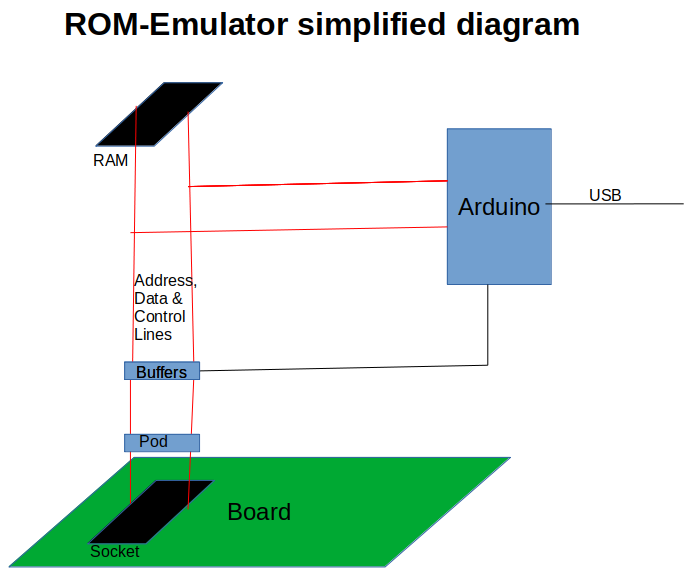
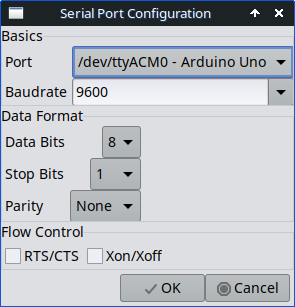
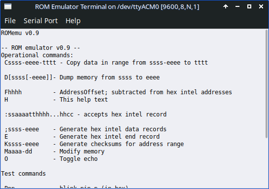

# ROM-emulator
Emulate a small size ROM with a RAM and Arduino with Intel-HEX interface

ROMemu is a combination of software and hardware that allows the usage of 
modern software development tools for simple, old style single board computer 
systems. It emulates an (EP)ROM programmer to the development software and 
an in-circuit ROM/RAM on the board.

Here a diagram showing how the ROM-Emulator works. In operational mode, 
the RAM chip is connected through the buffers and POD converter to the 
socket of the target board. All the Arduino pins connected to the RAM
are tri-stated, so the processor on the board sees the contents of the 
RAM. 

When the Arduino accesses the RAM, the buffers are tri-stated, isolating
the RAM from the board. The processor would see FFh in the memory region
addressed by the socket. The Arduino can now fill the RAM with data 
received from the PC, or change it with its internal commands.

A feature planned for the coming version is a relay allowing the Arduino
to set the target board processor in RESET mode during the transfer of 
data from the PC to the RAM. This prevents the processor from 'panicking'
when the ROM disappears from its memory.

## Firmware

The software (Arduino sketch) is version 0.11.4.

Current command set of the Arduino sketch:

        -- ROM emulator v0.11.4 --
        Operational commands:
         Cssss-eeee-tttt - Copy data in range from ssss-eeee to tttt
         D[ssss[-eeee]]- Dump memory from ssss to eeee
         E             - Generate hex intel end record
         Fhhhh         - AddressOffset; subtracted from hex intel addresses
         Gssss-eeee    - Generate checksums for address range
         H             - This help text
         :ssaaaatthhhh...hhcc - accepts hex intel record
         ;ssss-eeee    - Generate hex intel data records
         Kssss-eeee    - Generate checksums for address range
         Maaaa-dd      - Modify memory
         O             - Toggle echo
         R[0|1]        - Switch the RESET relay
         S1ccnnnndddd..ddss - accepts Motorola Exorciser S1 record
        Test commands:
         A             - test 32 kByte RAM with 00h, 55h. AAh and FFh patterns
         Bpp           - blink pin p (in hex)
         Nssss-eeee:v  - fill a memory range with a value
         Tp            - exercise port p
         U             - view ports C, L, A, CS, OE, WR, ARDUINOONLINE
         Wpp v         - Write pin (in hex) values 0, 1
         ?             - This help text

## Hardware

The current hardware version 1.3 is shield for the Arduino Mega 2560. The shield 
contains a 32 kByte RAM-chip which is (partially) readable by the target 
board processor via the pod for 24 or 28 pin sockets. The Arduino USB-connection 
is available as serial port to the development system. This allows to write 
Intel-hex data to the RAM.

The problems with the 1.1 version are solved with the 1.3 version. 
This version is in testing, but hasn't room for the relay. This might result
in a new board later.

The KiCAD-files contain the projects for the shield, adapter and socket-
PCBs. The first two have fixes from testing the previous produced boards.  

## Support software

For downloading hex-Intel or hex-S19 files the romEmuFeed.py is provided. It supports 
three arguments; the hex file, the serial port (optional, '/dev/ttyACM0' 
is default) and an optional offset address (in hex) for data that doesn't 
start at 0000h. The actual address in the CPU memory map is determined by 
the PCB circuit, not the emulator. So data usually needs to be starting 
at 0000h (of the emulator RAM).

    Usage: python3 romEmuFeed.py <hexFile> [<ttyPort>] [<hexOffset>]
    
The script could very well work for Windows and MacOS, but is untested.

A new and experimental download tool is the 'romEmuTerminal.py' application, 
a GUI replacement for the romEmuFeed.py program. It can select and configure 
the serial port, download Hex-intel files and monitor and control the ROM 
Emulator. It is developed and somewhat tested on Linux, but should work 
on Windows and MacOS to (courtesy of the wxTerminal.py it is based on).

 

There is a Hackaday page at: https://hackaday.io/project/175610-rom-emulator

F.J. Kraan, 2025-07-18
